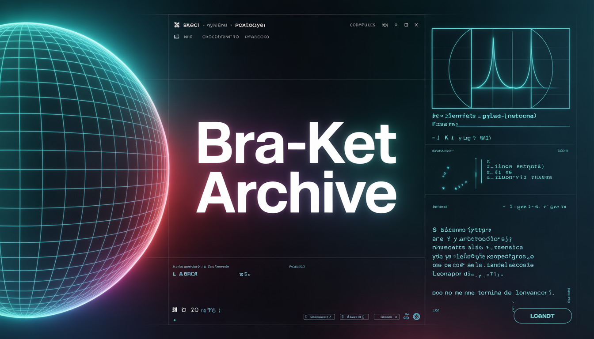

# ⟨ Bra-ket Archive | Mauricio ⟩ 

### Theoretical & Computational Physics 
Building a comprehensive archive of 500+ solved problems from the pillars of modern physics to achieve a **Direct PhD at the University of Cambridge**.

---

## 📚 Currently Solving:
*   **Arfken:** Mathematical Methods for Physicists (Chap. 1: Infinite Series)
*   **Jackson:** Classical Electrodynamics
*   **Sakurai:** Modern Quantum Mechanics

## 💻 Technical Stack:
*   **Simulations:** Python (Manim, NumPy, SciPy)
*   **Documentation:** LaTeX (Formal analytical derivations)

## 🔗 Connect with me:
[https://www.youtube.com/channel/UCU8PBiOcpkLhV0_TMgYx2vg] | [https://www.linkedin.com/in/l%C3%B3pez-merino-mauricio-2548ab322/] 

---
*"Only those who attempt the absurd can achieve the impossible."*
